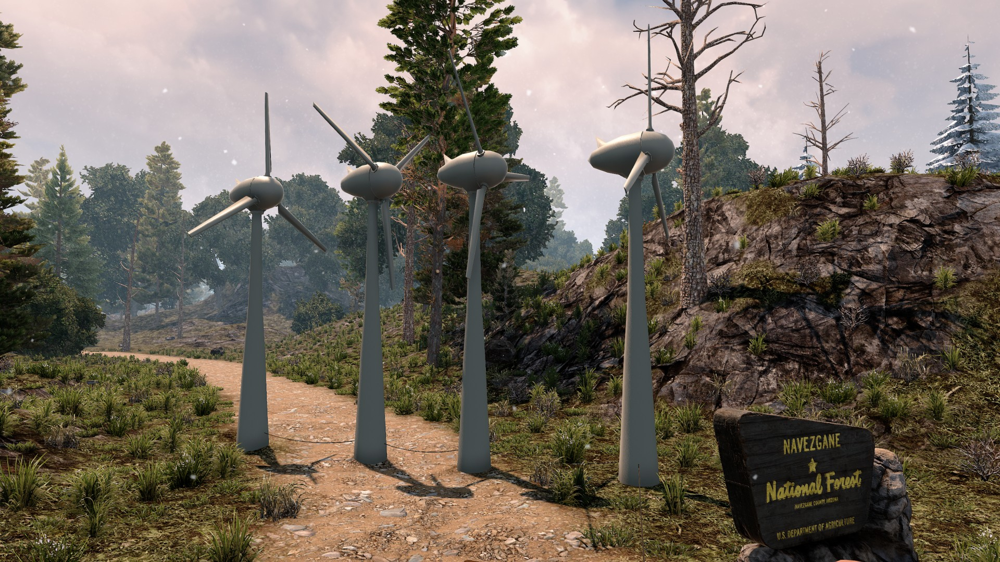

# OCB Electricity Wind Power Mod - 7 Days to Die Addon

Adding new power class and block for a modern windmill that
produces energy day and night by wind power. Although wind
is unpredictable, it still runs at around 50% capacity most
of the time. Highly advices to be used with a battery bank.

You need to disable EAC to use this mod!

First release, not yet tested very well!

This Mod is part of my bigger [electricity overhaul][1], but
should also work on its own. Also works in multi-player, but due to
custom resources each client needs to have the mod installed too.

## Important note

Wind speed is not linked to biome weather (yet), as I didn't see any
way to get local weather per x/z position, specially if running as a
dedicated server. For now the wind speed and direction is interpolated
via perlin noise, which should be good enough. But it can mean that in
edge cases your biome weather is extremely windy but the windmills are
running very slowly. At least we also simulate a generic wind direction,
which is IMO something the original game hasn't yet included.

## ToDo

- Describe how other models can be added
- Better integrate in electricity overhaul mod

## Changelog

### Version 0.1.1

- Change script to take in audio from unity plugin option

### Version 0.1.0

- Initial working version

## Compatibility

I've developed and tested this Mod against version a20.b238

[1]: https://github.com/OCB7D2D/ElectricityOverhaul
