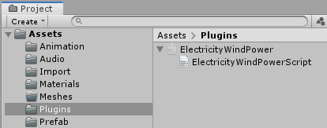
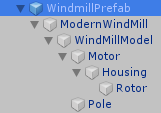
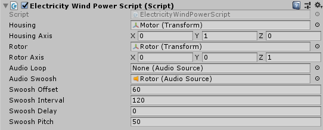
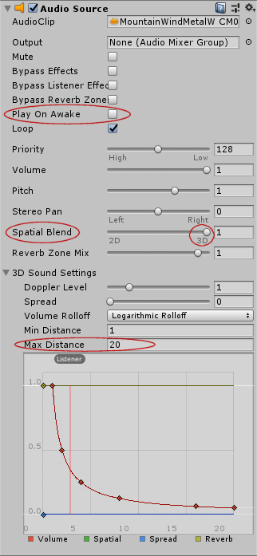
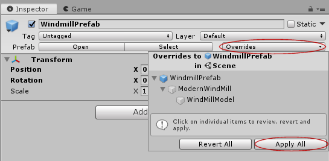

# OCB Electricity Wind Power Mod - 7 Days to Die Addon

Adding new power class and block for a modern windmill that
produces energy day and night by wind power. Although wind
is unpredictable, it still runs at around 50% capacity most
of the time. Highly advices to be used with a battery bank.

You need to disable EAC to use this mod!

First release, not yet tested very well!


This Mod is part of my bigger [electricity overhaul][1], but
should also work on its own. Also works in multi-player, but due to
custom resources each client needs to have the mod installed too.

## Important note

Wind speed is not linked to biome weather (yet), as I didn't see any
way to get local weather per x/z position, specially if running as a
dedicated server. For now the wind speed and direction is interpolated
via perlin noise, which should be good enough. But it can mean that in
edge cases your biome weather is extremely windy but the windmills are
running very slowly. At least we also simulate a generic wind direction,
which is IMO something the original game hasn't yet included.

## Create custom windmill models

For the first release I really just re-used an existing model for Xyth.
It may not be the most beautiful and detailed model, but worked nicely
to get the basics up and running. Now it would be cool to see some other
windmill models, like from old farms etc. This mod should have everything
one needs to create news model and export it as a unity3d resource.

You should already be familiar how to export unity3d resources, otherwise
you will need to get familiar with this step first (ToDo: link docs etc.).

### Custom windmill script

In order to animate the windmill, we use a custom unity script. This
encapsulates the behavior for the animation nicely from the rest of
the code. You can simply import the script in unity and then assign
it to your model and configure the necessary items there.

#### Importing the custom script

You find the plugin stub under `UnityPlugins/ElectricityWindPower.dll`
in this repo. This is only a stub for unity and doesn't contain any of
the behavior (so you will not see anything if you click play in the
unity editor). Don't worry, as the actual behavior will be loaded from
the main plugin dll `ElectricityWindPower.dll` when the game is loading.

- Create a folder in unity assets named `Plugins` (name must exactly
  match, as unity will treat it as a [special folder][2] due to its name).
- Drag and Drop the `UnityPlugins/ElectricityWindPower.dll` into it



#### Windmill prefab structure

The prefab you need to create has only a few requirements and even those
are just recommendations. It can have two joints that we rotate around.
You probably want to nest these two so the rotations are added. In my
example I rotate the `housing` into the wind, and the `rotor` rotates
according to the wind speed.



#### Configure the windmill script

It doesn't really matter to which node you attach the windmill script,
but I suggest to keep it close to the root (the code will actually look
into all children to find a reference during runtime).



- Housing: Choose which object to rotate into the wind
- Housing Axis: Actual rotation vector that is applied to it
- Rotor: Choose which object to rotate according to wind speed
- Rotor Axis: Actual rotation vector that is applied to it
- Audio Loop: A audio source that is playing when enabled
- Audio Swoosh: A audio source representing a single "swoosh"
- Swoosh Offset: Degrees after which the audio is played
- Swoosh Interval: How many degrees to wait until next swoosh
- Swoosh Delay: Time offset to delay the playing of the audio
- Swoosh Pitch: Pitch dampening factor (keep or tinker with it)

#### Additional unity properties

Make sure to add colliders and tags where needed. For completeness
I've included screenshots for all unity object properties:

- [unity-props-01-root](Screens/unity-props-01-root.png)
- [unity-props-02-model](Screens/unity-props-02-model.png)
- [unity-props-03-motor](Screens/unity-props-03-motor.png)
- [unity-props-04-housing](Screens/unity-props-04-housing.png)
- [unity-props-05-rotor](Screens/unity-props-05-rotor.png)
- [unity-props-06-pole](Screens/unity-props-06-pole.png)

#### Tip: Audio distance attenuation

In order for audio to attenuate correctly in Unity and 7D2D you need
to make sure that the audio source is correctly setup. Make sure to
move the `Spatial Blend` option to be fully 3D. This is probably the
most common mistake, since unity seems to default it to 2D, which
disables any distance attenuation. You should also disable the
`Play on Awake` option, since otherwise the audio is automatically
played when the player tries to put the block into the world.
Finally adjust the "Max Distance" to define how far the audio
should be audible (unit here is roughly the same as blocks).



#### Tip: Applying prefab changes

If you change something on an existing prefab, you need to update
that prefab first, before you can export it again. You can do that
by clicking on the inspector for the prefab to `Override` stuff:



### Create new block

If you're not familiar how to create new blocks, please make yourself
familiar with that topic first. It boils down to something like:

```xml
<block name="MyNewWindMill">
  <property name="Extends" value="ocbElectricityModernWindmill"/>
  <property name="Model" value="#@modfolder:Resources/MyWindMill.unity3d?MyPrefab" />
</block>
```

## Changelog

### Version 0.3.0

- Add Undead Legacy compatibility patches

### Version 0.2.0

- Add rustic windmill model (needs stators to produce power)
- Power generation is set to be half of the modern windmill (120W Max)
- New resource "small stator" scraps into brass and can be crafted at forges
- Change loot/scrap to include "small stator" in various electric items
- Add wind power schematic to unlock all new wind power items directly

### Version 0.1.1

- Change script to make rotation axes configurable
- Change script to take in audio from unity plugin option

### Version 0.1.0

- Initial working version

## Compatibility

I've developed and tested this Mod against version a20.b238

[1]: https://github.com/OCB7D2D/ElectricityOverhaul
[2]: https://docs.unity3d.com/2017.2/Documentation/Manual/SpecialFolders.html